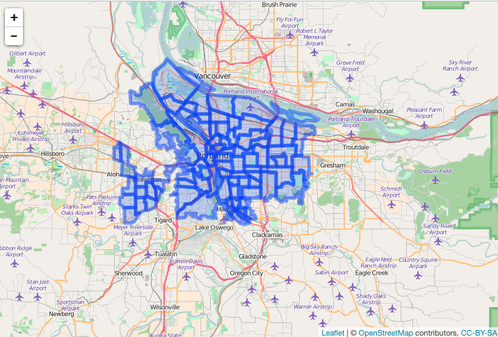

geojson
=======


```r
devtools::install_github("ropenscilabs/geojson")
```


```r
library("geojson")
```

## geojson class

this is just a characstring string with S3 class `geojson` attached to make it easy to perform operations on


```r
x <- "{\"type\":\"FeatureCollection\",\"features\":[{\"type\":\"Feature\",\"geometry\":{\"type\":\"Point\",\"coordinates\":[-99.74,32.45]},\"properties\":{}}]}"
as.geojson(x)
#> {"type":"FeatureCollection","features":[{"type":"Feature","geometry":{"type":"Point","coordinates":[-99.74,32.45]},"properties":{}}]}
```

## search geojson


```r
x <- "{\"type\":\"FeatureCollection\",\"features\":[{\"type\":\"Feature\",\"geometry\":{\"type\":\"Point\",\"coordinates\":[-99.74,32.45]},\"properties\":{}}]}"
x <- as.geojson(x)
sift_client(x, ".features[].geometry[]")
#> [1] "[\"Point\", [-99.74,32.45]]"
```

## sifting with jq

Using Zillow data, plot all data


```r
library("leaflet")
file <- system.file("examples", "zillow_or.geojson", package = "siftgeojson")
dat <- jsonlite::fromJSON(file, FALSE)
```


```r
leaflet() %>%
  addTiles() %>%
  addGeoJSON(dat) %>%
  setView(-122.8, 44.8, zoom = 8)
```


Filter to features in Multnomah County only


```r
json <- paste0(readLines(file), collapse = "")
res <- sifter(json, COUNTY == Multnomah)
```

Check that only Multnomah County came back


```r
res %>%
  jqr::index() %>%
  jqr::dotstr(properties.COUNTY)
#> [
#>     "Multnomah",
#>     "Multnomah",
#>     "Multnomah",
#>     "Multnomah",
#>     "Multnomah",
#>     "Multnomah",
#>     "Multnomah",
#>     "Multnomah",
#>     "Multnomah",
...
```

Plot it


```r
leaflet() %>%
  addTiles() %>%
  addGeoJSON(dat) %>%
  setView(-122.6, 45.5, zoom = 10)
```



## Meta

* Please [report any issues or bugs](https://github.com/ropenscilabs/sifter/issues).
* License: MIT
